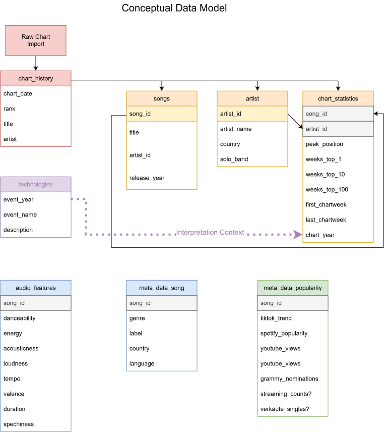

# Conceptual Data Model

## Overview

The conceptual data model describes the logical structure of the analytical database used in this project.

Its purpose is to separate different types of information into independent entities and to ensure that the database can easily be extended with additional data sources in the future.

---

## Motivation

The project combines several independent data sources, including:

- Weekly chart rankings
- Spotify audio features
- Song metadata
- Popularity indicators
- Historical technology milestones

To avoid redundancy and to simplify future extensions, the database is separated into several logical entities.

---

## Main Entities

- Songs
- Artists
- Chart History
- Chart Statistics
- Audio Features
- Song Metadata
- Popularity Metadata
- Technologies (Context Table)

---

## Design Decisions

- Raw chart data is never overwritten.
- Aggregated chart statistics are stored separately.
- Audio features are independent from metadata.
- Technologies are stored as interpretation context rather than song attributes.

---

## Diagram

---
Status: Completed
Version: 1.0
Last updated: 31 July 2026
---
