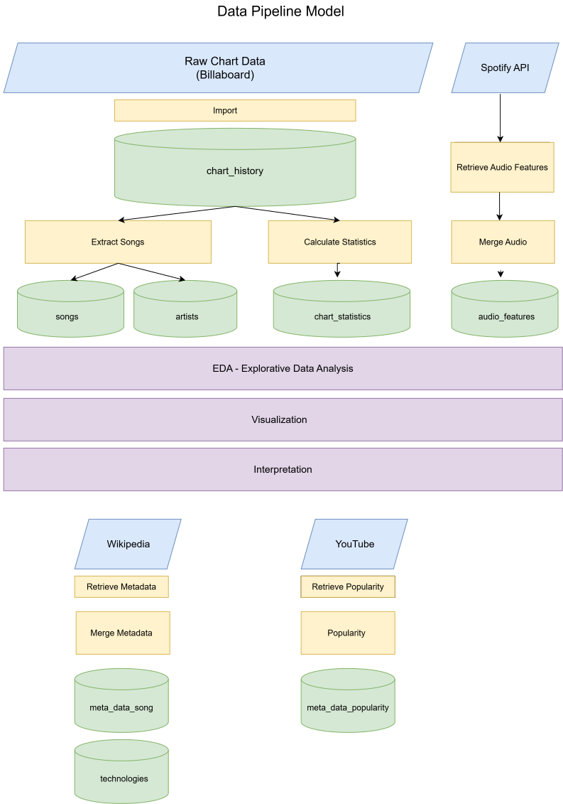

# Data Pipeline

## Overview

This diagram illustrates how raw chart data is transformed into the analytical database used throughout the project.

The pipeline documents every major processing step from data acquisition to the final analysis.

---

## Data Sources

External data sources include:

- Weekly chart rankings
- Spotify Audio Features
- Wikipedia
- YouTube

---

## Processing Steps

1. Import raw chart data
2. Extract unique songs
3. Create the songs table
4. Generate artists
5. Retrieve audio features
6. Retrieve metadata
7. Retrieve popularity information
8. Calculate chart statistics

---

## Analysis

After all datasets have been merged, the resulting database is used for

- Exploratory Data Analysis (EDA)
- Visualizations
- Interpretation of results

---

## Diagram

---
Status: Completed
Version: 1.0
Last updated: 31 July 2026

